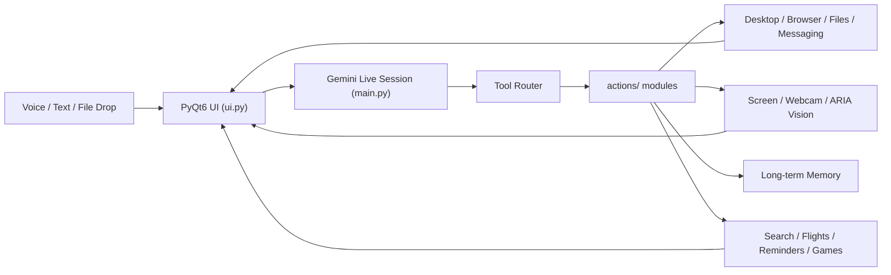

# 🤖 J.A.R.V.I.S.
### Real-time desktop AI assistant for voice, vision, files, and computer control

J.A.R.V.I.S. is a multimodal desktop assistant that listens through your microphone, reasons with Gemini Live, sees your screen or camera, works with dragged files, and takes real actions on your computer.

It is built for personal workflows, desktop automation, and "do it for me" requests that go beyond a chat window.

> Local desktop app, cloud reasoning.
> Bring your own Gemini API key.

---

## 🚀 What JARVIS Can Do

| Area | What it covers |
| --- | --- |
| 🎙️ Voice + chat | Real-time audio conversation, typed fallback, activity log, wake-word behavior |
| 🖥️ Computer control | Open apps, press hotkeys, type, click, scroll, focus windows, take screenshots |
| 🌐 Browser automation | Open pages, search, click elements, fill forms, switch browsers with Playwright |
| 👁️ Vision | Analyze the screen, webcam, or ARIA camera feed |
| 📄 File workflows | Summarize PDFs, OCR images, inspect code, analyze CSV/Excel, convert media, unpack archives |
| 📅 Productivity | Weather, reminders, flight search, desktop cleanup, game updates, messaging |
| 👨‍💻 Developer tools | Explain, edit, run, optimize code, or scaffold small multi-file projects |

---

## 💬 Example Prompts

- `Jarvis, open Telegram and send Alice I'll be 10 minutes late.`
- `Jarvis, what is on my screen right now?`
- `Jarvis, summarize this PDF I just dropped in.`
- `Jarvis, find the best flight from Moscow to Istanbul next Friday.`
- `Jarvis, update my Steam games tonight.`
- `Jarvis, review this Python file and tell me what's wrong with it.`

---

## 🏗️ Architecture



At a high level:

1. `main.py` opens a Gemini Live session and streams microphone audio in real time.
2. Gemini decides when to call a tool from the local tool registry.
3. A tool in `actions/` performs the actual desktop, browser, file, or vision task.
4. The result is spoken back and logged in the UI.

---

## ⚡ Quick Start

### 1. 🐍 Create a Python environment

Python `3.11` or `3.12` is recommended.

```bash
git clone <your-repository-url>
cd JARVIS

python -m venv .venv
source .venv/bin/activate
# Windows: .venv\Scripts\activate

pip install -r requirements.txt
python -m playwright install
```

If you want the built-in bootstrap script instead, run:

```bash
python setup.py
```

### 2. 🔐 Add your config

Create `config/api_keys.json` using `config/api_keys.example.json` as a template:

```json
{
  "gemini_api_key": "YOUR_GEMINI_API_KEY",
  "os_system": "mac"
}
```

Valid values for `os_system`:

- `windows`
- `mac`
- `linux`

`config/api_keys.json` is already ignored by git.

### 3. ▶️ Launch JARVIS

```bash
python main.py
```

On first real use, your OS may ask for permission to access:

- 🎤 microphone
- 🖼️ screen recording / screen capture
- 📷 camera
- ⌨️ accessibility controls

---

## 🧩 Feature-Specific Extras

Some advanced tools need extra packages or system binaries beyond `requirements.txt`.

| Feature | Extra requirement |
| --- | --- |
| Browser automation | `python -m playwright install` |
| Data files (`csv`, `xlsx`) | `pip install pandas openpyxl` |
| PDF / Word workflows | `pip install pdfplumber PyPDF2 python-docx` |
| Audio utilities | `pip install pydub` |
| Video / audio conversion | `ffmpeg` available in your system `PATH` |
| ARIA object / face features | `pip install ultralytics face-recognition` |

If a platform-specific module fails with `ModuleNotFoundError`, install the missing package for your OS and rerun the action.

---

## 🗂️ Project Map

```text
.
├── main.py                # Live session, tool declarations, execution loop
├── ui.py                  # PyQt6 desktop interface
├── actions/               # All tool implementations
├── memory/                # Long-term memory and config helpers
├── config/                # Local API key config (gitignored)
├── aria/                  # Local vision helpers and known-face data
├── agent/                 # Task queue / planner utilities
├── core/prompt.txt        # System behavior and routing rules
└── intent_classifier/     # Production-style NLP intent classification module
```

Some especially useful modules:

- `actions/browser_control.py` for browser automation 🌐
- `actions/file_processor.py` for dropped-file workflows 📄
- `actions/computer_control.py` for direct mouse/keyboard/screenshot actions 🖱️
- `actions/send_message.py` for app-based messaging automation 💬
- `actions/dev_agent.py` and `actions/code_helper.py` for developer workflows 👨‍💻

---

## ⚠️ Notes And Caveats

- This is not a fully offline assistant. Reasoning and real-time speech depend on Gemini. ☁️
- The assistant is configured to respond only to prompts that begin with `Jarvis`, `Hey Jarvis`, or `Okay Jarvis`. 🗣️
- Cross-platform support is a core goal, but some tools are more mature on some operating systems than others. 🧭
- Several optional features rely on external binaries, browser installs, or extra Python packages. 📦
- The `intent_classifier/` module is a dedicated NLP subsystem in the repo, even though the main live assistant currently routes through Gemini tools. 🧠

---

## 🧠 Intent Classifier

A production-style NLP module inside [`intent_classifier/`](intent_classifier/README.md) that classifies user commands into intents with confidence scores.

- TF-IDF + Logistic Regression, trained on 4,200 samples
- Deployed as a FastAPI REST service
- MLflow experiment tracking and model versioning
- CI/CD via GitHub Actions
- Confidence-based drift detection in production

See [`intent_classifier/README.md`](intent_classifier/README.md) for details.

---

## 👤 Creator

Engineered by zowel.
